# ECE16 Final Report
Prepared by: Mike Liu
Date: 03/19/2020

## Potential Failure Points
### Taps
> Since we have the accelerometer flat on the table we only need to worry about the accelerometer responding to the z dimension. As a result it is unresponsive when the tap is occuring at a different orientation. For example if the accelerometer is held vertically and the tap is going into the accelerometer (like going into the wall) since the direction of acceleration change is going in the y or x direction without a significant change in z. There will be no response from the current algorithm that builds detection off of thresholding on z,x,or y. And each time the orientation of the accelerometer changes, the resting value for each x,y,or z also changes which does not fit the model of thresholding.
>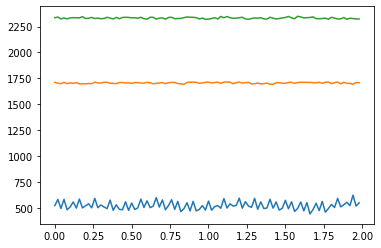
> This is when it is flat on the table. So note the different values for each change in orientation.

>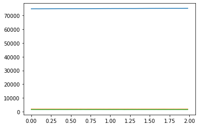
>Upside down

>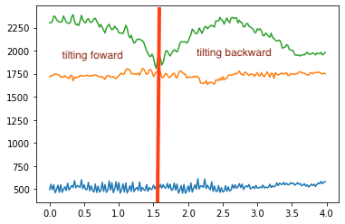
>I tilted the accelerometer forward and result in a change in overall value of x and y. Note that the same thing happens with side tilts
>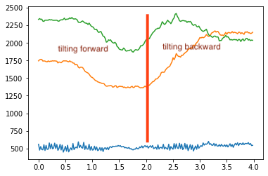
>X Y side tilt. So if there are taps the difference in threshold would be different for each value.

> If we attempt to detect taps while moving the accelerometer would respond to the x and y axis along with a change in z (just by the nature of walking). When we walk we step out and step back in that results in a change in our z each time taking a step (just watch as a person walks their head will bob slightly) which collects data that is not in spikes of the graph but when x,y,z exceed a "certain" threshold. Let's not account for the swinging motion of the arm if the accelerometer is worn like a watch that results a even more drastic three dimensional movement.

> The threshold algorithm we imposed (without graphical analysis) is extremely prone to see multiple taps, even there was only one, when the change of z lasts for too long. So one tap could become two or three. This was a common error when I was testing the buzzer tap challenge in Lab02. The solution offered at the time was to minimize the detection z threshold. However the method was extremely fickle since people tap at different strenghts and their way of tapping is different each time as well. The model then becomes extremely suited for one person but not applicable for other people.

### Heart Rate Monitor
> A factor that the heart rate monitor does poorly is when it is starting to collect data. That is if the data started recording before a person's hand is on, it will record the extremely large spike and invalidate the data set if we are setting up the machine learning algorithm. It also drags the spike across the recorded heart rate lower if real time analysis is done on counting the BPM.

> Since the heart rate monitor MAX 30105 runs off of a set of IR and RGB LED, it also accepts other wavelengths from the the enviornment. So when it is recording data, a lot of noise is also recorded when it is ran in an enviornment with unstable lighting. In one of my recordings outside, I did it in an area with a lot moving shadows the lighting resulted in some very jumbled data. Below are some examples of me removing a light source (held by my roommate) from my device. Note the deep caves and spikes compared to a normal set of heart beat data

>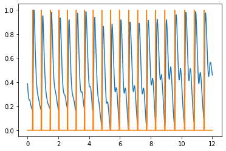
>Normal data set
>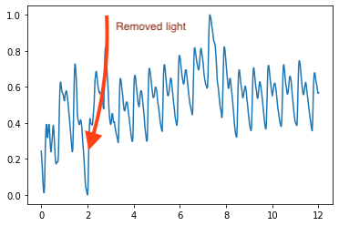
>Removing Light 01
>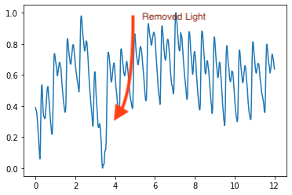
>Removing Light 02
>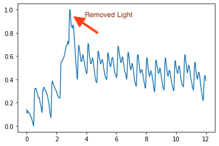
>Removing Light 03

> The heart rate is recorded on a stable platform with an immobile user. When the user starts moving around, ie walking. The collected ehart rate data starts flying all over the place. This is especially prevalent on the action of sitting down and standing up. The current algorithm basically counts the spikes tot he IR change - time graph. Moving around tampers with the consistency of the detected difference. So it results in places with deep caves and high peaks that drown out other signals that can occur at the same period. 

>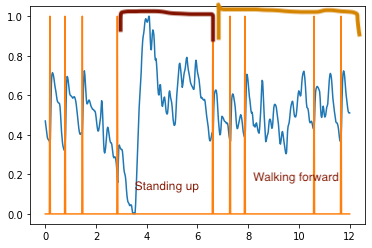
>Standing up and walking around

>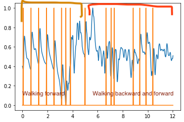
>Walking around

## Challenge
### Detect Taps with Different Orientations
The objective is to detect the taps off the accelerometer accurately when it is not just held flat on the table (on wall, upside down, anything really). If this issue is solved then it doesn't matter how the accelerometer is held, it could still detect taps even if it is moved in to a different orientation. This is also a step to improve the algorithm so it can handle movement of when the person wears the accelerometer and taps it.

>So the objective is to combine the directions X, Y, and Z into an algorithm that would handle the situations that when the accelerometer is held stead at any angle and orientation would still find and detect that the taps have happened. However since X,Y,Z are independent variables in a space, resulting in three seperate lines on a graph.
>
>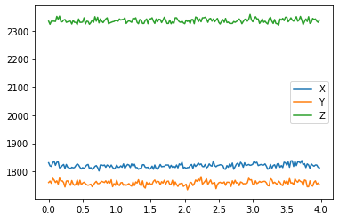
>However trying to define the taps with three seperate lines (three directions) is rather difficult (really it's because I'm lazy) to calculate an accurate occurance of tapping because it tends to look like this
>
>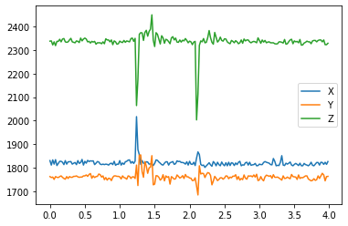
>
>There were two taps in this situation

>My solution is combining the data sets of all dimensions into one coherent set which requires some elementary algebraic magic. Really I just took the square of each dimension, took the sum of them, and the square root. Which resulted in a graph that looks much nicer and conveys the same information.
>
>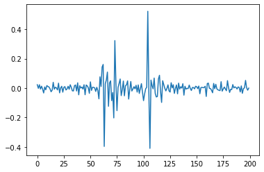

```python
def take_sqrt(s):
    i=0
    while i < np.size(s):
        s[i] = math.sqrt(s[i])
        i+=1
    return s
def take_square(s):
    i=0
    while i<np.size(s):
        s[i] = s[i]*s[i]
        i+=1
    return s

def process(s, n_avg):
    s = HR.signal_diff(s)
    s = HR.normalize_signal(s)
    s = HR.detrend(s, n_avg)
    return s
    
cuml = np.array(data_array[:,1]*data_array[:,1]+data_array[:,2]*data_array[:,2]+data_array[:,3]*data_array[:,3])

square = np.array(HR.take_square(cuml))

pro = HR.process(cuml,5)
```
>However looking at the ML code we had before. I wondered if I can use machine learning for learning to find the taps but the result was rather diastrous. I collected a bunch of data and ran it through the gauntlet but the problem was that when I used the testing set, it would only find the large taps but could do nothing about smaller taps that were not as obvious. This might be due to the way I detrended the data which favored strong taps strongly (not a pun) and is rather insensitive to smaller taps.
>The next step to my potential solution was using Pxx,Freqs psd from heart beat sensor and now looking back. I don't even know why I attempted that. Tapping is not a regular pace like heart beat. But here is some nonsense graphs I got as output
>
>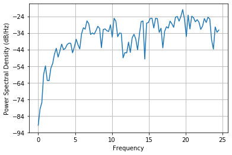
>
>no tap
>
>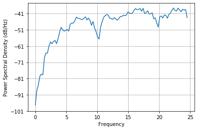
>
>one tap
>
>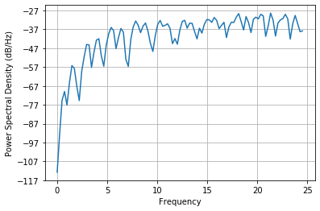
>
>two tap
>


