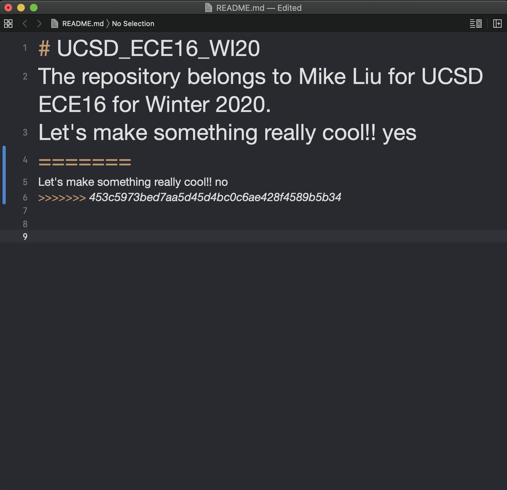
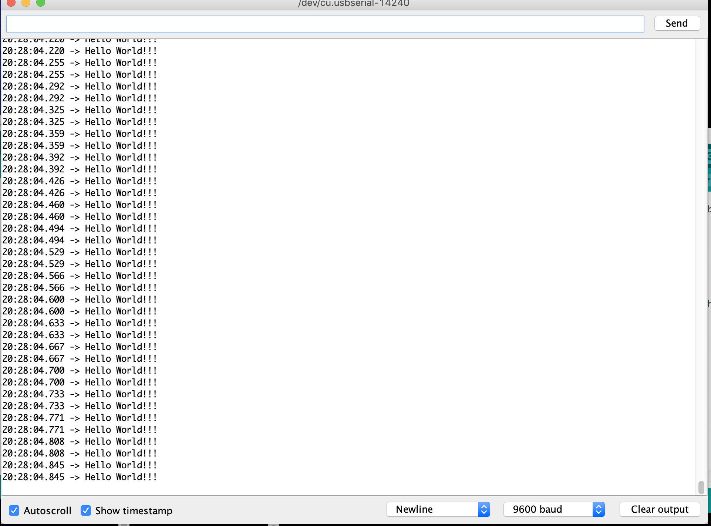
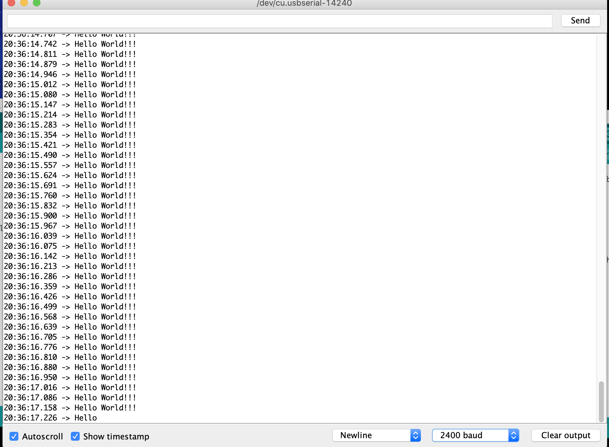
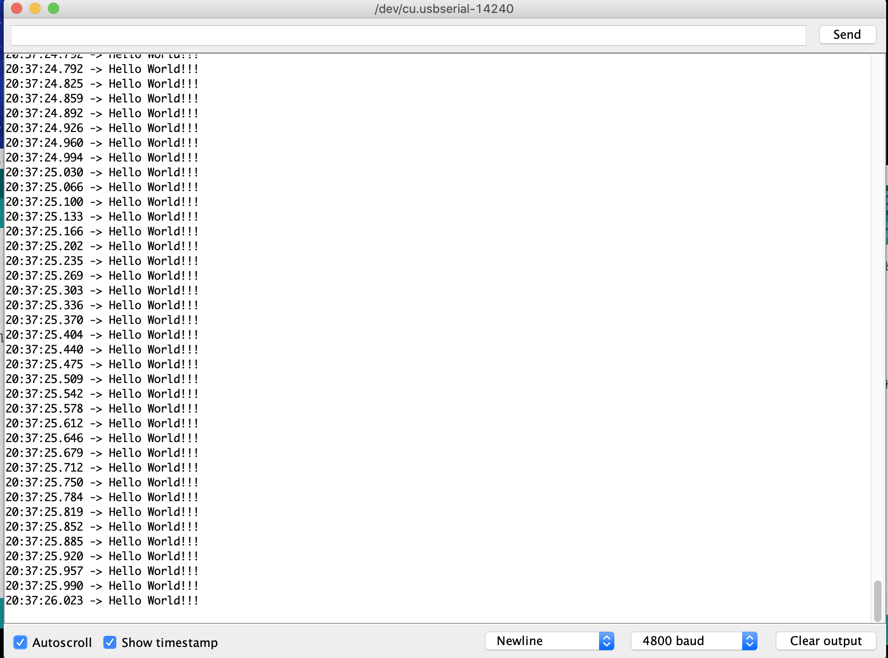
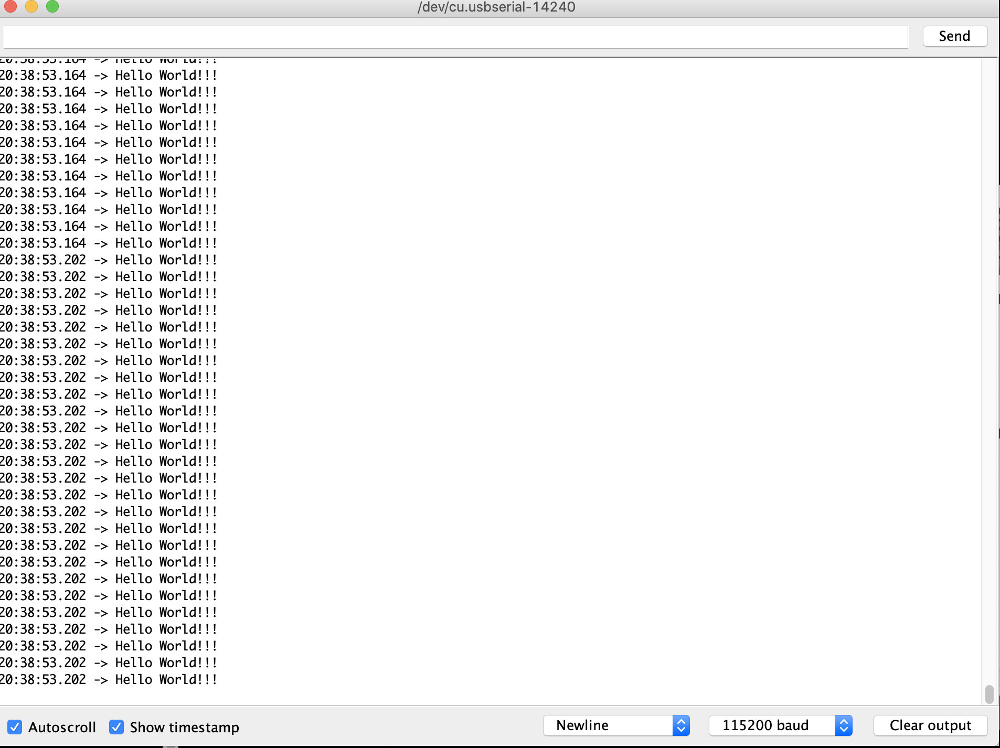

# ECE16 Lab01 Report
Prepared by: Mike Liu
Date: 01/15/2020

>Q. What is the frequency of the blink rate in this example? Note that frequency is the inverse of the time it takes for a cycle. A cycle is the time it takes to go HIGH to LOW to HIGH again. Record a video of your FireBeetle blinking.  Make a note of the answer for now, in the next GIT tutorial, you will get a copy of a sample lab report.

>A. The frequency of the blink rate in this example is 0.666Hz because the frequency is the time it takes to go from HIGH to LOW and back again which the time from HIGH to LOW is 0.5s and LOW to HIGH is 1s. The total time is 1.5 seconds. f=1/T=1/1.5=0.666.
>

>Q. When you open the conflicted readme, what did you get? How did you fix it?

>A.  When I opened the conflicted readme, it had the changes recorded on Github segemented by >>>>>>HEAD and ======= and under ======== and <<<<<<<< is the edits that existed on my computer. I fixed it by recording one of the changes that is available from the options and deleted the >>>>>>HEAD, =======, and <<<<<<<<<
>

>Q. Why do we need a pull-up resistor? Describe the behavior without it.

>A. The reason why we need pull up resistors is because having a resisotr ensures that there is always a "valid" state for the GP/IO pin to recieve. So when the power is longer supplied or the IO pin is no longer recieving then the IO pin has an actual reply instead of some conflicting disconnected signal. On the Firebeetle it was represented by a reveresed and flickering signals when the button is not pressed, basically it demonstrates the leftover signals when the button is not pressed and without a pull up resistor.

>Q. Which GPIO pin did you have to use according to the above setup?

>A. According to the above setup I used GPIO pin 26. The assignments to the GPIO pins are written on the back of the Firebeetle

>Q. What is the expected current draw? 
 
 >A. The expected current draw is 5mA because the voltage supplied is 3.3V and the LED has a voltage drop of 2.2V and the resistor used is 220Ohm. As a result the current draw would be seen from the resistor where the experienced voltage is 1.1 and since V=IR then I_draw=1.1/220=0.005A=5mA
 
 >Q. What is the limit for the GPIO? You can find this on the ESP32_WROOM datasheet: https://www.espressif.com/sites/default/files/documentation/esp32-wroom-32_datasheet_en.pdf . Look under IOH.
 
 >A. According to the ESP32_WROOM datasheet the current limit of the GPIO pin is around 40mA with an error of 5mA to be safe, 35mA
 
 >Q. In your report, run the above code at Baud Rate of 9600. How many seconds are between each Hello World? What did you expect the time between each print statement to be and what did you actually get? 
 
 >A. When "Hello World!!!" was ran at a Baud Rate of 9600 there is an interval of 30 to 40ms in between each output and there tend to be clumps at where the interval is at 0 but only occur from observable scale in clumps of 2.
 >
 >Hello_World_9600_Lab1.png
 
 >Q. How does this change when you change the baud rate to 2400, 4800, and 115200. (When you change the baud rate, you’ll also need to change the Serial Monitor’s Baud Rate. The answer to this question should be quantitative and not just qualitative.  Remember that baud rate refers to how many bytes per second is sent. Remember that an ASCII character is 8 bits. 
 
 >A. When the Baud Rate is changed from 2400, 4800, and 115200, I expected the interval to be 46ms, 23ms, and 0.97ms respectively. However what I got was 70s, 33ms, and 38ms. The interval for the 2400 and 4800 is forgivable since there is a time for loop and a 1ms delay. The 115200 has signficant gaps between expected and actual how it is compensated by the large clumps that tend be generated that when counted times the expected interval is around the time stamps given by the serial monitor. In general, as the Baud Rate increases so does the rate at which the data is printed out on the Serial Monitor.
 >
 >Hello_World_9600_Lab1.png
 >
 >Hello_World_4800_Lab1.png
 >
 >Hello_World_115200_Lab1.png
 
 >Q. Note the tabs shown in the figure (for Button, LED, Message, and Timer), please make these four tabs.
 
 >A. Tabs for Button, LED, Message, and Timer have been created and used in Challenge 1-3. Check in folder src/Arduino/Lab1_Challenges
 
 ## Challenges
 
 ### Challenge 1: LED Blink Frequency
 The objective of this challenge is to identify and recreate the blink frequency requested by the lab with built-in LED and red, yellow, and blue LED from our given kits. I wired the LEDs to GPIO pins 26, 27, and 13 respectively and connected all given LEDs to a suitable resistor which is then connected to GND. Then wrote the code for the conditions 1 through 6 in Lab_Challenges Arduino file under LED tab and setup and loop through Lab_Challenges tab.
 
>Q. What are the resistor values you chose for each of the LEDs?

>A. I chose 1000Ohm resistor for all of the LEDs because using a high resistor is better than short circuiting the Firebeetle

>Q. Videos showing each condition (please record in landscape-horizontal mode)

>A.
>
>Condition 1: builtin_1Hz.gif
>
>
>Condition 2: builtin_10Hz.gif
>
>
>Condition 3: builtin_50Hz.gif
>
>
>Condition 4: red_led.gif
>
>
>Condition 5: yellow_led.gif
>
>
>Condition 6: blue_led.gif

### Challenge 2: Timer - Part 1
>The objective is to have the Firebeetle respond in the Serial Monitor when the button is pressed a timer is started from 0s and continues counting up until the button is released. To do this the functions to the Timer was seperated under Message (to control and setup the output to Serial Monitor), Timer (to control the counting of time, print, and run when it is called), and Button (to control and setup the appropriate response when the button is pressed). In the main tab (Lab_Challenges) a new function is created specifically for the Challenge called Lab1_C2 that executes the timer on certain conditions. The button is connected to GPIO pin 25 with a pull up resistor and connected to GND.

>Q. What is the average time elapsed for each second increment? Use millis() to help you with this task. Describe how you measured this.  

>A. The average time elapsed for each second increment is exactly 1000ms measured using millis() that is called whenever the timer is incremented in the main tab. So when the timer is called it flags the time and prints it out to the serial monitor for reference. This differs from the average time elapsed recorded from the time stamp from the serial monitor that has an average of 1019ms. This is because the time stamp just tells what time it is during the print out to Serial Monitor while millis() rounds off the time it took to execute each line and loop so it is exactly 1000ms.
>.png)
>Challenge_2_millis().png

### Challenge 3: Timer - Part 2
