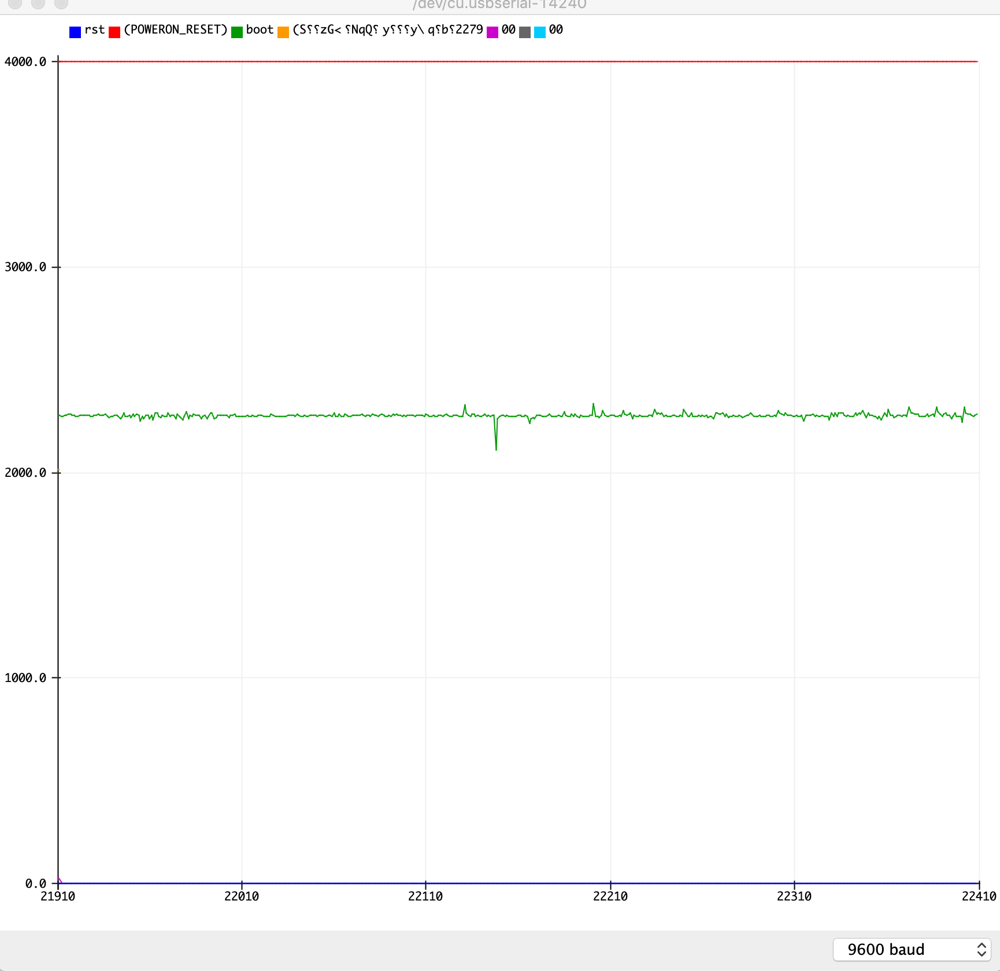
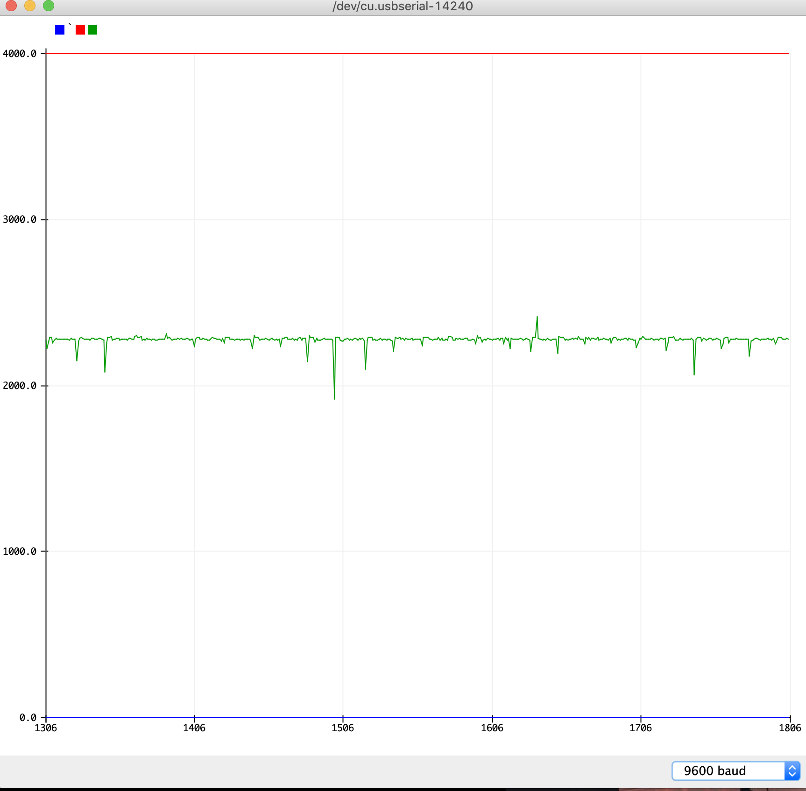
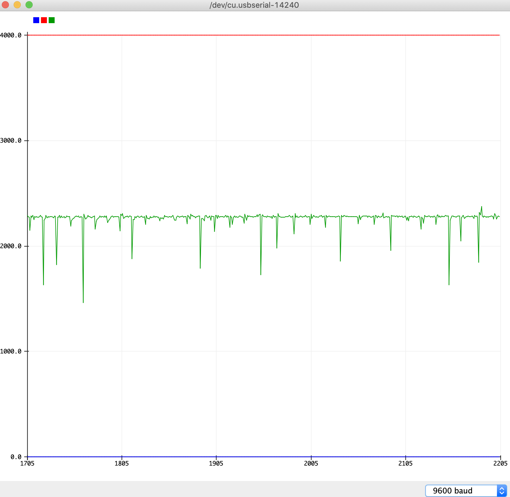

# ECE16 Lab02 Report
Prepared by Mike Liu
01/29/2020
>Q. How many bits is your ADC? Try connecting your A0 pin to 3.3V. How did you calculate the bits?

>A. My ADC is 12 bits. To calculate the bits of an ADC use the equation ADC Resolution/Supplied Voltage = ADC Analog Reading/ Analog Voltage Measured. I also looked it up on the datasheet to check

>Q. What is the resting value of the accelerometer when it is laying face up. Why is it not 0? What is this value in terms of volts (remember that 3.3V is the maximum).

>A. The resting value of the acceleromter when it is laying face up is around 2270 ± 10 this is because the accelerometer is constantly testing the acceleration on a surface that is stable but not exactly still. The value is not rested at 0 because there is an acceleration downwards constantly (g = Earth_grativation_acceleration=9.81m/s^2) in terms of voltage the value is around 1.8V using the equation from the previous question 4092/3.3=2270/Read Voltage.

>Q.Tap the accelerometer light, medium, and hard. What is the average value of each tap? How did you calculate this? Please don’t ask us if you are tapping correctly, use your judgement :) Show a screenshot of the accelerometer plotting and tapping at different strengths.

>A. When tapping light, medium, and hard, all average values are 2700 because at each tap there is a high and a low correspondingly because the accelerometer is not on a rigid surface. The PCB acts like a spring so there is a negative and positive acceleration whenever it is tapped. However if all values are averaged for their difference away from the resting value. Then for light it is 10, medium is 30, and hard is 100. If it is all positive then it is 2710, 2730,and 2800 respectively. The same can be done in negative depend on the graph 2690, 2670, 2600.
>
>Light
>
>Medium
>
>Hard
