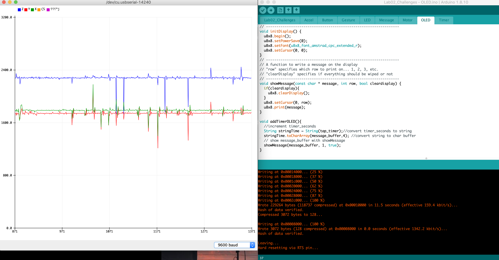
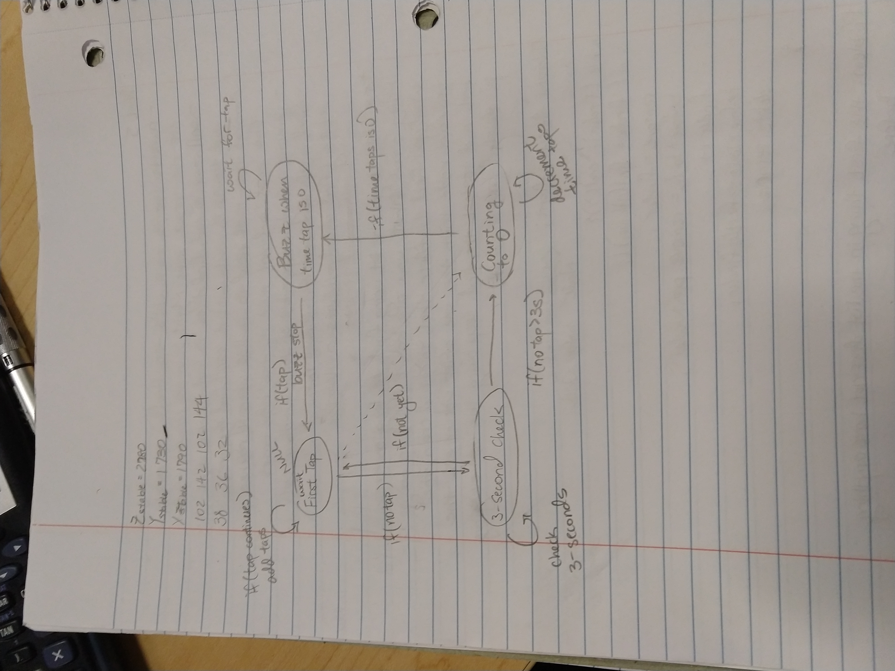

# ECE16 Lab02 Report
Prepared by Mike Liu
01/29/2020
>Q. How many bits is your ADC? Try connecting your A0 pin to 3.3V. How did you calculate the bits?

>A. My ADC is 12 bits. To calculate the bits of an ADC use the equation ADC Resolution/Supplied Voltage = ADC Analog Reading/ Analog Voltage Measured. I also looked it up on the datasheet to check

>Q. What is the resting value of the accelerometer when it is laying face up. Why is it not 0? What is this value in terms of volts (remember that 3.3V is the maximum).

>A. The resting value of the acceleromter when it is laying face up is around 2270 ± 10 this is because the accelerometer is constantly testing the acceleration on a surface that is stable but not exactly still. The value is not rested at 0 because there is an acceleration downwards constantly (g = Earth_grativation_acceleration=9.81m/s^2) in terms of voltage the value is around 1.8V using the equation from the previous question 4092/3.3=2270/Read Voltage.

>Q.Tap the accelerometer light, medium, and hard. What is the average value of each tap? How did you calculate this? Please don’t ask us if you are tapping correctly, use your judgement :) Show a screenshot of the accelerometer plotting and tapping at different strengths.

>A. When tapping light, medium, and hard, all average values are 2700 because at each tap there is a high and a low correspondingly because the accelerometer is not on a rigid surface. The PCB acts like a spring so there is a negative and positive acceleration whenever it is tapped. However if all values are averaged for their difference away from the resting value. Then for light it is 10, medium is 30, and hard is 100. If it is all positive then it is 2710, 2730,and 2800 respectively. The same can be done in negative depend on the graph 2690, 2670, 2600.

>
>Light
>
>
>Medium
>
>
>Hard

>Q. In the above figure, assuming we are showing 2ms of data, what is the PWM frequency?

>A. According to the above figure if we are showing 2ms of data, then the PWM frequency is 500 since you would be showing the figure at every 2ms interval in a 1 second span. So 1000ms/2ms = PWM frequency

>Q. Why is 100% duty cycle 255 instead of 256?

>A. This is because in an 8 bit system there exists 256 different values that includes 0 and the system is designed around the available time slots which for the Firebeetle is (2^n)-1 which allows for the system to be continuously on or continuously off since the number of outputs is (2^n)-1.

>Q. We purposely made some mistakes in the above example.  What were they? It will not work directly, but by reading the compilation error, the tutorial instructions, and comments carefully, you should have no trouble getting it to work!

>A. The errors from the example above are misspelling the variable pwmBitResolution (global or in setup doesn't matter it has to match), not adding semicolons (;) at the end of delay(100) statements (all of them), and when it is suppose to write to the pwmChannel the code used ledcAttachPin() instead of ledcWrite();

>Q. Again we made some intentional mistakes in the code above. What were they?

>A. The errors from the code are missing semicolon (;) at u8x8.begin(), calling the void showMessage(const char * message, int row, bool cleardisplay) as void showMessages(const char * message, int row, bool cleardisplay) in main setup, and calling a nonexistent variable messages for u8x8.print() instead of existing variable message.

>Q. What did the Arduino receive? How does this change if you use different line endings?

>A. The arduino recieved the keystrokes that I input into the input line as ASCII characters. If I change different line endings certain values are recieved or taken out. For example, if I said Newline only then it includes the ASCII equivalent of a Newline whenever I send over the message which is 10 at the end of the ASCII character values that I gave.

>Q. What are the Decimal values of NL (new line) and CR (Carriage Return)?

> A. The decimal values of NL is 10 and decimal values of CR is 13. In ASCII 13 means carriage return (pressing the return button) and 10 means LF or new line feed or new line.

## Challenges

### Challenge 1: Fading Buzzer
The objective is to wire a fading buzzer with PWM frequencies. I wrote the Arduino code based on the PWM with ledcSetup(), ledcAttachPin(), and ledcWrite(). The Setup sets the frequency, channel, and resolution of the PWM and I connected the input pin for the buzzer with the channel. Using the input from buzzMotor() I wrote the  buzz_power as an integer for the level of buzz the motor should go through with PWM frequency

>Q. Which pin does the code ask you to use for the motor?

>A. I used the GPIO 05 as asked for in the code.

>Q. Why can’t we achieve this speed variation using a digitalWrite and instead has to use ledcWrite?

>A. digitalWrite only has two states High or Low. It doesn't allow for a great variation of buzz power that can be done with Pulse Width Modulation in ledcWrite.

### Challenge 2: Gesture Detection
The objective is to create an algorithm with the accelerometer and OLED to detect tapping on the accelerometer. I wrote the code based on the fact that the device is placed on a flat surface, so the only effect is the Z axis.  Then I return the that is tapped to the OLED display that displays the occurance.

>Q. What are some different logics you tried and why? What are some situations where you noticed your detection algorithm doesn’t work well?

>A. I tried using a tapTimer that accounts for the time that the finger or whatever is tapping with the accelerometer in order to get a single notice of tapping for one tap instead of multiple due to the fast refresh rate of the data collected. It worked well until for some reason in the middle it stopped working so I took it out since it wasn't necessary anymore due to the sensitivity of the accelerometer dropped significantly (I might have broke it - though it still works). Other than the additional logic my logic still rests on testing only on the Z axis. When I did the other axis I rarely get an accurate response because tapping by nature is up and down.

>Q. Provide a screenshot of a plot showing 5 taps and the threshold used. 

>A. 
>
>Challenge02_5Taps

>Q. Include a video of you tapping on the accelerometer and the OLED counting each time. 

>A.
>
>Challenge02_5Taps.gif

### Challenge 3: Read and Write to OLED
The objective is to read a bunch of characters from the Serial Monitor and print it out to the OLED display. Extending from the previous OLED from the last Challenge and the Serial_Print in the tutorial. I allowed the Serial monitor to read my inputs on the input line with Serial.read() and I stored those chars in an array of chars that will output when it meets a newline character ('/n'). The output is thrown to showMessage() that displays to the OLED

>Q. Video of a message typed into the serial monitor and appearing on the OLED. This video should be shot WITHOUT moving the camera. 

>A.
>
>Challenge03_Message.gif

>Q. What happens if you write a really long message? Why?

>A. If I write a really long message it starts giving me garbage characters or characters that has shown up in the same order as I typed some messages. This is because the OLED display has a limited amount of characters allowed per line and if it overflows it tries to make sense of it by overwriting the existing spaces on the same line or combine some of them to make garbage characters.

### Challenge 4: Non-blocking logic
The objective is to use non-blocking logic to check for taps and start the timer if last tap was 3 seconds a go. Extending from Challenge 2 I took the basic tap detection and added a timer=millis() that keeps track when the accelerometer is tapped. Then I compared on a running loop that if the accelerometer is not tapped for more than 3 seconds with timer-millis() then it runs the decremenation until 0.

>Q. As a thought exercise, how might you implement this using BLOCKING logic? 

>A. If using blocking logic I would have a variable time_block that totals tiny increment of time whenever the delay is called between the execution of a loop. Then there is a global variable that time_mark that marks down the time of the last tap inside of the check if tapped and then I would time_block - time_mark>=3000 to execute the same logic in checking if the accelerometer was tapped 3 seconds ago

>Q. How would you use NON-BLOCKING logic to set the sampling rate of the accelerometer to 50Hz? Write a pseudo code. 

>A. To do this I would go inside Gesture under detectTap() and modify the logic around reading the ADC, readADC(). I would write:
timer=millis();
if(elapsed time >= 2ms){ //elapsed time = timer-millis()
    readADC();
}
This ensures that the detection only reads at 50Hz=1/t; t=2ms. So reading at 50Hz means sampling per 2ms interval

### Challenge 5: State Machine of the Watch
Draw and plan out the state machine of the watch (mainly the timer and the process that follows). There will be four states in total in the drawing: waiting for First tap, 3-second check, count to 0, and Buzz when time is 0. The state machine should go through the motions of how the timer works and ensures that there are no operations that are left out. I drew out the process for the state machines and arrows represent that actions that go from state to state. 

>Q. How many states do you need? Describe in words what each state does and it’s transition logic. Draw the state machine

>A. I need four states in total. There will be four states in total in the drawing: waiting for First tap, 3-second check, count to 0, and Buzz when time is 0. First tap checks when there is tapping to count up the timer and will keep going until there is no tapping then passes to 3-second check. 3-second check makes sure that there is no tapping in 3 seconds, if there is passes it back to first tap to wait for more taps. If there are no more taps in 3 seconds then it goes to counting that takes in no taps and decrement the taps until it is 0. Then it passes to the Buzz when time tap is 0 and keeps buzzing while waiting for tap. If it finds a tap then the buzz stop and the state machine reset to where it started.
>
