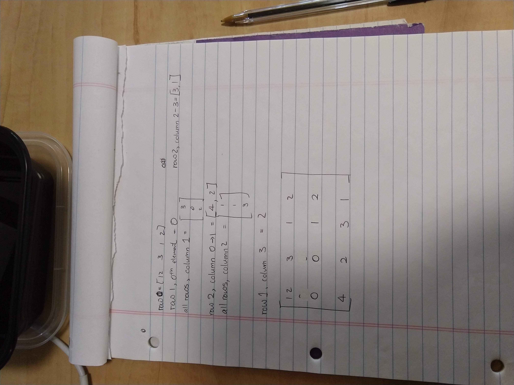

# ECE16 Lab03 Report
Prepared by Mike Liu
02/11/2020

>Q. Show the code - Starting with a = “Hello World!!!”, come up with a code that will give us b = “Hello” and c = “World” and d = “!!!” . Also, in code, check if “ello” is in a. 

>A. 
```python
    a='Hello World!!!'
    print(a)

    b = ""
    for x in range(0, 5):
        b=b+a[x]
        
    print(b)

    c = ""
    for x in range(6, 11):
        c+=a[x]
        
    print(c)

    d = ""
    for x in range(11, 14):
        d+=a[x]

    print(d)
```
>Q. In the following code, what is the output of the print statement? Why doesn’t original_list = ['hi','how','are','you']?

>A. The output of the print statement is not original_list = ['hi', 'how', 'are', 'you'] is because the print statement prints the original statement that is unchanged while newer_list is the one updated

>Q. Try sending without the .encode. What happens? 

>A. If it is sent without .encode then the Python code will not run. It throws an error since there is not an implicit converter from string to bytes which .write(byte) accepts.

>Q. Identify in the above code, (1) which python command prints to the python’s own console, and (2) which python command prints to the serial port to the MCU?

>A.
(1) There is not code that prints to the python's console. The command that prints to python's console is print() which is not present in the given code.
(2) ser.write(S.encode('utf-8') is the python command that prints to the serial port to the MCU.

>Q. What happens if you take out the \n in the string? Why?

>A. If I take out the \n in the string the OLED does not update from the Serial port because the Serial port is waiting for a newline character (/n) which it does not receive. So the "Hello World" displayed on the OLED is the first "Hello World" even if I continuously update the python file.

>Q. Describe the output you observe on the Python side? 

>A. The output on the Python's side is a part of the of the printed timer statement that the Arduino sends to the serial port. It doesn't hold the whole thing, it prints out exactly 30 characters including \r and \n

>Q. Change the code to read 10 bytes instead of 30. Now what do you get? What are the 10 bytes you received? Remove decode might help you understand

>A. Whe the code is changed to 10 bytes it prints out 10 characters including \r and \n of the timer that the serial is suppose to output from the Arduino. 
Output without decode: b'TIMER:\r\n1\r'
Output with decode: TIMER:
                                    1

>Q. Describe the output you observe on the Python side? Is it the same as before? What does this tell you about the print() function of python? 

>A. The output on the Python side for readSerial2(ser) prints out one character and a newline at a time so all the bytes are shown vertically while readSerial3(ser) outputs everysingle character as an entire array that was appended during execution. The print() function of Python has an automatic conversion to output any string or array, etc based on the type of variable with distinct format. In short it is very flexible in printing to console. 

>Q. We purposely made a few errors above. What were they? 

>A. Try: is suppose to be try: ; s = ser.read(1) is suppose to be s = ser.read(1).decode('utf-8')

>Q. Show the code - Make an Numpy Array called test_array  from a list = [0,10,4,12]. Subtract 20 from the test_array, what do you get? What is the shape of the test_array

>A. If I subtract 20 from the array I get [-20 -10 -16  -8], and the shape of the array is (4,) or 4 columns

>Q. Show the code - Make a 2D array of test_2D_array from [0,10,4,12],[1,20,3,41]

>A.
```python
    test_2D_array = np.array([(0,10,4,12),(1,20,3,41)])
    print(test_2D_array)
```
>Q. Make a 2D array of zeros with shape of 10x20 and then print it out

>A. 
[[0. 0. 0. 0. 0. 0. 0. 0. 0. 0. 0. 0. 0. 0. 0. 0. 0. 0. 0. 0.]
[0. 0. 0. 0. 0. 0. 0. 0. 0. 0. 0. 0. 0. 0. 0. 0. 0. 0. 0. 0.]
[0. 0. 0. 0. 0. 0. 0. 0. 0. 0. 0. 0. 0. 0. 0. 0. 0. 0. 0. 0.]
[0. 0. 0. 0. 0. 0. 0. 0. 0. 0. 0. 0. 0. 0. 0. 0. 0. 0. 0. 0.]
[0. 0. 0. 0. 0. 0. 0. 0. 0. 0. 0. 0. 0. 0. 0. 0. 0. 0. 0. 0.]
[0. 0. 0. 0. 0. 0. 0. 0. 0. 0. 0. 0. 0. 0. 0. 0. 0. 0. 0. 0.]
[0. 0. 0. 0. 0. 0. 0. 0. 0. 0. 0. 0. 0. 0. 0. 0. 0. 0. 0. 0.]
[0. 0. 0. 0. 0. 0. 0. 0. 0. 0. 0. 0. 0. 0. 0. 0. 0. 0. 0. 0.]
[0. 0. 0. 0. 0. 0. 0. 0. 0. 0. 0. 0. 0. 0. 0. 0. 0. 0. 0. 0.]
[0. 0. 0. 0. 0. 0. 0. 0. 0. 0. 0. 0. 0. 0. 0. 0. 0. 0. 0. 0.]]

>Q. Show the code - Out of the test_array, create the following using hstack and vstack. 

>A.
```python
    test_hstack_array = np.hstack((test_array, test_array))
    test_vstack_array = np.vstack((test_hstack_array,test_hstack_array,test_hstack_array,test_hstack_array))
    print(test_vstack_array)
```

>Q. Show the code - Using arange, make an array called arange_array1 to equal [-3, 3,9,15] and arange_array2 to equal [ -7,  -9, -11, -13, -15, -17, -19]

>A. 
```python
    arrange_array1 = np.arange(-3,16,6)
    print(arrange_array1)
    arange_array2 = np.arange(-7,-20,-2)
    print(arange_array2)
```
>Q. Make an array call linspace_array using linspace that goes from 0 to 100 with 49 steps. 

>A.
```python
    linspace_array = np.linspace(0,100,49)
    print(linspace_array)
```

>Q. How does linspace and arange differ? When might you use one over the other?

>A. Arrange and linspace differ by that arange starts at one point and steps for a certain amount of spaces until it runs till the endpoint while linspace has a set desired number of values it wants and outputs evenly spaced values between the start and endpoints. arrange is used when stepping within a certain range of numbers with a set space while linspace is used when you want even spacing between numbers like taking averages.

>Q. What is an array of size 3x4 that would produce the following results. Show your work on how you deduced your answer on paper or some kind of graphics :
print(e[0])     >>> [12 3 1 2]
print(e[1,0])  >>> 0
print(e[:,1])   >>> [3 0 2]
print(e[2, :2])>>> [4 2]
print(e[2, 2:])>>> [3 1] 
print(e[:,2])  >>> [1 1 3]
print(e[1,3]) >>> 2

>A.
3X4_Tutorial_Matrix

>Q. Show your code - Now solve the above indexing and slicing problem by writing the code using array assignment. 

>A.
```python
    zero_array = np.zeros((3,4))
    zero_array[0]=[12,3,12,2]
    zero_array[1,0]=0
    zero_array[:,1]=[3,0,2]
    zero_array[2,:2]=[4,2]
    zero_array[2,2:]=[3,1]
    zero_array[:,2]=[1,1,3]
    zero_array[1,3]=2
    print(zero_array)
```

>Q. Using fromstring, vstack, and a for loop, create an array of 100x4 from s: [[1,2,3,4],[1,2,3,4],[1,2,3,4]…..[1,2,3,4]]. 

>A. 
```python
    data_string = '1,2,3,4'
    data_array = np.fromstring(data_string,dtype=int,sep=',')
    print_array = data_array
    for x in range(0,99):
        print_array=np.vstack((print_array,data_array),)
    print(print_array)
```

