# ECE16 Lab05 Report
Prepared by Mike Liu
03/09/2020

## Tutorial Part 1

>Q. If your sampling rate was 120Hz, what would be your maximum frequency (the Nyquist frequency)?

>A. If the sampling rate was 120Hz the maxiumum frequency is 60Hz because the Nyquist frequency is half of hte sampling rate.

>Q. If your signal bandwidth is composed of 0-10Hz, what is your minimum sampling rate to capture this signal based on the Nyquist sampling theorem? What would be recommended in general practice however?

>A. If the signal bandwith is composed of 0 - 10Hz the minimum smapling rate is 20Hz to capture this signal based on the Nyquist sampling theorem. Howeer for general practice we use 40Hz (4 times the maximum).

>Q. Show the code - Use np.argmax to find the actual dominant frequency of the x acceleration (currently labeled as 1Hz in the above plot). The aim here is to use argmax to get the index of the maximum value of Pxx and then use that index to get the corresponding frequency in the Freqs array. Try this with and without removing the DC offset. What do you get?

>A. Without the DC offset the np.argmax gets the index with the highest value which is at 0Hz since there is an obvious spike in the graph at 0Hz when it starts recording. That is without the DC offset
```python
import numpy as np
import matplotlib.pyplot as plt
from scipy import signal

data_array = np.genfromtxt('appendix_a.csv', delimiter=',')#get data from Appendix A and save as .csv.

fs = 50#sampling rate in Hz
t = data_array[:,0]#get the time array
s = data_array[:,1]#get the x-acceleration array
z = data_array[:,4]
det = signal.detrend(z)

plt.subplot(311)
plt.plot(t, s)
plt.subplot(312)
plt.psd(s, NFFT=len(t), Fs=fs) #plot the power spectral density
plt.subplot(313)
plt.psd(det, NFFT=len(t), Fs=fs)
Pxx, Freqs = plt.psd(s, NFFT=len(t), Fs=fs)
pmax = np.argmax(Pxx)
print(pmax)
plt.show()
```
>Q. If we don’t remove the DC offset first, how can we index Pxx such that when we calculate argmax, we don’t look at the Pxx[0] (skipping the 0 index).

>A. If we don't remove the DC offset first, we can index Pxx to remove the first element of its array by using Pxx[0:] that makes a new array that does not have the first element of Pxx
```python
skipped_index=0
index_skipped=skipped_index+1
pmax = np.argmax(Pxx[skipped_index:])+index_skipped
print(pmax)
```
>Q. What is the dominant frequency for the y and z acceleration in the sample?

>A. The dominant frequency for all accelerations (x through z) are all at 1Hz
>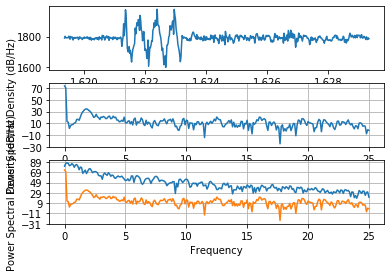
>x
>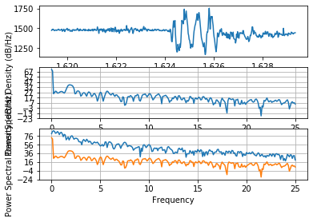
>y
>
>z

## Tutorial Part 2

>Q. what is the correct regex to get trial “0” for any subject given our naming convention “ID_Trial_HR.csv”. 

>A.
```Python
allfiles = glob.glob(directory + "/*01*.csv")
print(allfiles)
```
>Q. Manipulating File Names

>A. I borrowed the test code from Owen so test cases look similar. But I did the code alone after some very annoying single line loops
```Python
import glob
import numpy as np
from scipy.stats import pearsonr
import matplotlib.pyplot as plt
from scipy import signal
from scipy import signal as sig
import os


directory = "/Users/mikeliu/Desktop/ECE 16/ece16-wi2020-m7liu/src/Python/LAB05/All_Heart_Beat_Data/*.csv"
allfiles = glob.glob(directory)
#unique = list(set([file.split("\\")[1][0:2] for file in set(allfiles)]))
single = list(set(file.split("\\")[0][86:88] for file in set(allfiles) ))
print(single)

failed_test = False
print("Numbers of Test")
for i in range(1, 13):
    test_condition = "{:02d}".format(i)
    
    test_result = test_condition in single
    print("Has " + str(test_condition) + "? " + str(test_result))
    if not(test_result):
        print("FAILED TEST " + str(i))
        failed_test = True
        break

# TEST 2: IS A LIST

if not(failed_test):
    print(failed_test)
    
    
    
    
    
for file in allfiles:
    #print(file)

    data_array = np.genfromtxt(file, delimiter=',')
```
Here is the output
```python
runfile('/Users/mikeliu/Desktop/ECE 16/ece16-wi2020-m7liu/src/Python/LAB05/ML.py', wdir='/Users/mikeliu/Desktop/ECE 16/ece16-wi2020-m7liu/src/Python/LAB05')
['02', '04', '09', '11', '06', '07', '05', '01', '03', '08', '10', '12']
Numbers of Test
Has 01? True
Has 02? True
Has 03? True
Has 04? True
Has 05? True
Has 06? True
Has 07? True
Has 08? True
Has 09? True
Has 10? True
Has 11? True
Has 12? True
False
```
## Challenges

### Challenge 1
Write the code to filter the response from Appendex A through signal.butter() in order to filter a low pass signal from Scipy
>Q. Looking at the documentation for signal.butter, how would you make a high pass filter with a cut off of 0.8Hz? Of the previous time based filters in Lab 4, which filter is most like the high pass filter?

>A.  To make a high pass filter with a cutoff at 0.8Hz use signal.butter(3, 0.0032,'highpass') where 0.0032 is the half-cycles/sample of Nyquist sampling while still using 3rd order. Of the previous time based filters the detrending the moving average looks most like a high pass filter but it has a less of a curve there.

### Challenge 2
From the data collected from Lab04 or record 10 new plots of heart beat data plot the PSD and PPG of each heart signal with a 10X2 grid plots. Plots on the left side should be PPG-time and right PSD-frequency.

>Q. How does the dominant frequency change with regards to the heart rate?

>A. Generally as the heart rate increases the dominant frequency also increases according, except the 77 bpm one. Might just be bad data judging from the PPG-time graph

>Q. If the heart rate is 65BPM, what is approximately the fundamental frequency? What about the second and third harmonic? Why is it that even though the heart rate is 65BPM, there are higher frequency content than just the fundamental frequency? What does this imply about how you should be setting your sampling rate if you expect a heart rate maximum of 180BPM?

>A. The fundamental frequency of 65BPM is 1.0833Hz (65/60). The second and third harmonics are 1.0833*2=2.166Hz and 1.0833*2=3.25Hz respectively. Higher frequency content above the fundamental frequency is just the nature of harmonic frequency. Imagine a string that is allowed to vibrate, the lowest speed that it is allowed to oscillate is the fundamental frequency. However with the same string we can vibrate it faster in terms of n*FF Hz that the wave generated from the string has n-1 nodes of the FF. These are the fundamental frequencies based off a single string that it is possible to have higher frequencies higher than the FF as long as there are n-1 sinusodial wave nodes so it results in a n*FF frequency. So if we want the suggested sampling rate of 180BPM we should set it to 180/60 = 16Hz*2 = 32Hz as the Nyquist frequency. However we should have it four times in practice so the max is 72Hz. With sampling frequency at 50Hz.

### Challenge 3
Add a new function in HR class, calc_heart_rate_freq, where you feed in a one dimensional np array and the sampling rate as fs. Analyze the performance of your system using Correlation Plot and Bland-Altman Plot. Do this for both the time domain algorithm and also for the frequency domain algorithm. 

>Q. What are some failure modes of your frequency domain solution?

>A. Some failure modes are:
Inconsistent readings: it affects how well the heart beat is detected so if different force is applied to each instance of the reading a lot of noise and poor data results. For example it could be adjusting your hand or finger on the sensor or applying a different force on the sensor to adjust readings

High Freqency readings: it is difficult to read at high frequencies at some reason even though it should be more detailed the result tend to more garbled than usual. Especially for high heart rates that it spikes fit to R almost = 1. Best I got was using the 0.2 with the smallest R.

>Q. Compare and contrast the two different algorithms. Which has a lower error? Which has a bias closer to 0? Do you see any signs of mean tracking in either algorithm? Use the correlation and difference plots to support your argument.

>A. Of the two the lowest error is the frequency domain with time with the least bias. This may be because when frequency records the wrong beat it gets it really wrong as it records the most prominant beat first and sticks with it while time averages out as it progresses. I don't think I seen signs of mean tracking in either algorithms since both sets of data tend to deviate away from the line of fit while frequency tends to undershoot the expected data while time fits around the line of R. That said, I have really bad data either way. Behold the edited verison:
>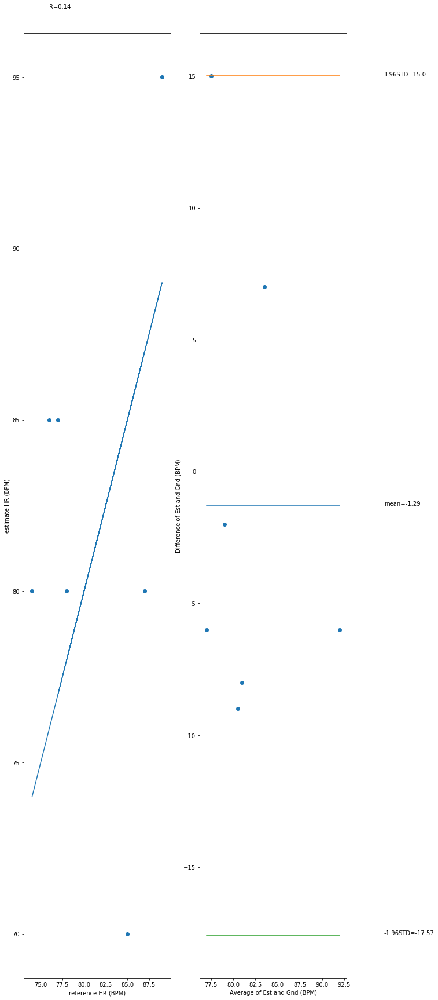
Time based


>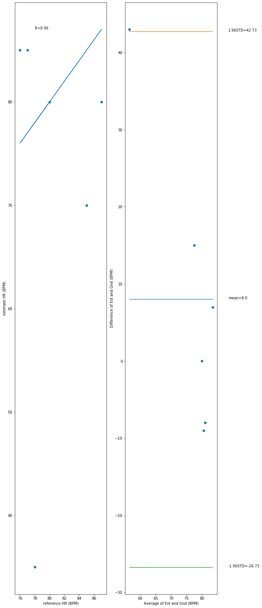
Frequency based

### Challenge 4
Split data so it is organized like how it is said in said in class (by subject) split files into training and testing based on ratio discussed in class 9:1. Then read training and store into usable lists

>Q. According to the lecture, what is the recommended split between training and testing on a small dataset? 

>A. According to the lecture the recommended split between training and testing is 17:3 or 85% : 15% respectively. If it is with a training, validation, and testing set then it is 17:3:3 or 70% : 15% : 15%

>Q. Why is it important to split on subjects and not to treat each file as an independent sample?

>A. It is important to split on subjects and not to treat each file as an indpenedent sample because heart beats are a characteristic that differs from person to person. One may have a behavior that is especially prominant in one person while not in another. By splitting by subject by individuals it insures that the sample is not over trained to a person with a specific type of pattern. The goal of Machine Learning is to get the most general approximation on a set so using a person with a very specifc patter does not help in generating a general approximation.

>Note: Whoever had 05 for ID had bad data and 01 had 2 duplicates so I took the liberty of taking it out of the training files
>The following is the used code:
```Python
#!/usr/bin/env python3
# -*- coding: utf-8 -*-
"""
Created on Tue Mar  3 10:43:40 2020

@author: mikeliu
"""
import glob
import numpy as np
from scipy.stats import pearsonr
import matplotlib.pyplot as plt
from scipy import signal
from scipy import signal as sig
import os

def calc_heart_rate_freq(signal,fs):
   b,a = sig.butter(3, .2, btype='low')
   signal = sig.detrend(signal)
   signal = sig.lfilter(b,a,signal)
   Pxx, Freqs = plt.psd(signal, NFFT=len(signal), Fs=fs)
   slice_from = 3
   peaks, _ = sig.find_peaks(Pxx[slice_from:], distance=20)
   heart_freq = Freqs[slice_from:][peaks[0]]
   return heart_freq * 60


def calc_heart_rate_time(s,fs):
    s_diff = signal_diff(-s) #preprocess the signal, I chose to use diff
    norm_s_diff = normalize_signal(s_diff) #normalize the signal
    threshold = 0.7 #empirically determined to be a good threshold
    s_thresh = [int(val > threshold) for val in norm_s_diff] #threshold the normalized signal. convert to int from boolean in order to perform logic of up or down transition
    s_thresh_up = signal_diff(s_thresh) > 0 #check for up transition (start of heart beat)
    BPM = np.sum(s_thresh_up)/((len(s_thresh_up)+1)/fs/60) #count the number of heart beats and divide by the total time. Total time is calculated as the length of the measurement (samples) / fs (samples/s) / 60 (min/s). This gives us beats/min
    return BPM

def normalize_signal(s):
    norm_signal = (s - np.min(s))/(np.max(s)-np.min(s))
    return norm_signal


def moving_average(s,n_avg):
    ma = np.zeros(s.size)
    for i in np.arange(0,len(s)):
        ma[i] = np.mean(s[i:i+n_avg])
    return ma

def signal_diff(s):
    s_diff = np.diff(s,1,0)
    s_diff = np.append(s_diff, 0) #np.diff returns one shorter, so need to add a 0
    return s_diff

def detrend(s, n_avg):
    ma = np.zeros(s.size)
    for i in np.arange(0, len(s)):
        ma[i] = np.mean( s[i:(i + n_avg)] )    
    return s - ma


file_directory = "/Users/mikeliu/Desktop/ECE 16/ece16-wi2020-m7liu/src/Python/LAB05/All_Heart_Beat_Data/*.csv"
directory = "/Users/mikeliu/Desktop/ECE 16/ece16-wi2020-m7liu/src/Python/LAB05/All_Heart_Beat_Data"
allfiles = glob.glob(file_directory)
#unique = list(set([file.split("\\")[1][0:2] for file in set(allfiles)]))
unique_ids = list(set(file.split("\\")[0][86:88] for file in set(allfiles) ))
#print(directory)
#print(unique_ids)

list_data = np.array([])
list_sub = np.array([])
list_ref = np.array([])
list_time = np.array([])
#sub_id in the list of unique_ids

j=0
k=0
total_files=0
for sub_id in unique_ids:
    #using glob get the files of all files with this subject id
    sub_files = glob.glob(directory + "//" + sub_id + "_*_*.csv")
    k+=1
    #print(sub_files)
    filter_order = 3
    filter_cutoff = 0.2
    #print(i)
    print("Acessing File of ID: " + sub_id)
    i=0
    for sub_file in sub_files:
        print("Accessing File: " + str(sub_file))
        
        data_array = np.genfromtxt(sub_file, delimiter = ',')
        heart_rate_data = data_array[:,4]
        t = data_array[:,0]
        #print(np.arange(0, len(heart_rate_data)))
        #print(len(heart_rate_data))
        heart_rate_data = detrend(heart_rate_data, 4)
        
        b,a = signal.butter(filter_order, filter_cutoff, btype='low')
        heart_rate_data = signal.lfilter(b,a,heart_rate_data)
        
        #shove things into list_data but not too much or it goes bonkers
        #if list_data[j].size > 500:
            #list_data[j]=list_data[j]
        if list_data.size > 0:
            list_data = np.vstack((list_data, heart_rate_data[:500]))
        else:
            list_data = heart_rate_data[:500]
        list_sub = np.append(list_sub, int(sub_id))
        heartrate_ref_string = sub_file.split("_")
        heartrate_ref = int(heartrate_ref_string[len(heartrate_ref_string) - 1].split(".")[0])

        list_ref = np.append(list_ref, heartrate_ref)
        for l in range (0, 500): 
            j+=2000
            list_time=np.append(list_time,j)
        i+=1
    print("sub_id: " +sub_id + " has " + str(i) + " Files recorded")
    total_files+=i
        #each file in the list of files for this subject
        #data = #read the csv
        #hr_data = #get the ppg signal from data using slicing
        #preprocess your hr_data:removing baseline, smooth your signal using a low pass filter and normalize. 
        #append the preprocessed data to list_data
        #append the subject id to list_sub
        #retrieve the reference heart rate from the filename.
        #append the reference heart rate to list_ref
print("Total Files Accessed: " + str(len(list_data)))
print("Total sub_id: " + str(k))
print("Total Files Opened: " + str(total_files))
if total_files==10*len(unique_ids):
    print("ALL FILES OPENED AND ACCESSED")
else:
    print("SOME FILES NOT ACCESSED")
a = list_data.flatten()
plt.plot(list_time, a)


    
#print(file.split("\\")[1][0:2] for file in set(allfiles) )

```
>Output of plot
>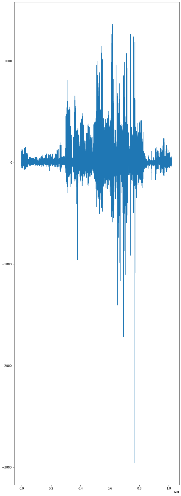

>Output of terminal
```
runfile('/Users/mikeliu/Desktop/ECE 16/ece16-wi2020-m7liu/src/Python/LAB05/ML.py', wdir='/Users/mikeliu/Desktop/ECE 16/ece16-wi2020-m7liu/src/Python/LAB05')
Acessing File of ID: 02
Accessing File: /Users/mikeliu/Desktop/ECE 16/ece16-wi2020-m7liu/src/Python/LAB05/All_Heart_Beat_Data/02_10_085.csv
Accessing File: /Users/mikeliu/Desktop/ECE 16/ece16-wi2020-m7liu/src/Python/LAB05/All_Heart_Beat_Data/02_09_085.csv
Accessing File: /Users/mikeliu/Desktop/ECE 16/ece16-wi2020-m7liu/src/Python/LAB05/All_Heart_Beat_Data/02_02_082.csv
Accessing File: /Users/mikeliu/Desktop/ECE 16/ece16-wi2020-m7liu/src/Python/LAB05/All_Heart_Beat_Data/02_06_090.csv
Accessing File: /Users/mikeliu/Desktop/ECE 16/ece16-wi2020-m7liu/src/Python/LAB05/All_Heart_Beat_Data/02_03_074.csv
Accessing File: /Users/mikeliu/Desktop/ECE 16/ece16-wi2020-m7liu/src/Python/LAB05/All_Heart_Beat_Data/02_07_087.csv
Accessing File: /Users/mikeliu/Desktop/ECE 16/ece16-wi2020-m7liu/src/Python/LAB05/All_Heart_Beat_Data/02_01_071.csv
Accessing File: /Users/mikeliu/Desktop/ECE 16/ece16-wi2020-m7liu/src/Python/LAB05/All_Heart_Beat_Data/02_04_080.csv
Accessing File: /Users/mikeliu/Desktop/ECE 16/ece16-wi2020-m7liu/src/Python/LAB05/All_Heart_Beat_Data/02_05_080.csv
Accessing File: /Users/mikeliu/Desktop/ECE 16/ece16-wi2020-m7liu/src/Python/LAB05/All_Heart_Beat_Data/02_08_077.csv
sub_id: 02 has 10 Files recorded
Acessing File of ID: 04
Accessing File: /Users/mikeliu/Desktop/ECE 16/ece16-wi2020-m7liu/src/Python/LAB05/All_Heart_Beat_Data/04_10_62.csv
Accessing File: /Users/mikeliu/Desktop/ECE 16/ece16-wi2020-m7liu/src/Python/LAB05/All_Heart_Beat_Data/04_02_64.csv
Accessing File: /Users/mikeliu/Desktop/ECE 16/ece16-wi2020-m7liu/src/Python/LAB05/All_Heart_Beat_Data/04_06_67.csv
Accessing File: /Users/mikeliu/Desktop/ECE 16/ece16-wi2020-m7liu/src/Python/LAB05/All_Heart_Beat_Data/04_04_66.csv
Accessing File: /Users/mikeliu/Desktop/ECE 16/ece16-wi2020-m7liu/src/Python/LAB05/All_Heart_Beat_Data/04_08_73.csv
Accessing File: /Users/mikeliu/Desktop/ECE 16/ece16-wi2020-m7liu/src/Python/LAB05/All_Heart_Beat_Data/04_01_65.csv
Accessing File: /Users/mikeliu/Desktop/ECE 16/ece16-wi2020-m7liu/src/Python/LAB05/All_Heart_Beat_Data/04_03_65.csv
Accessing File: /Users/mikeliu/Desktop/ECE 16/ece16-wi2020-m7liu/src/Python/LAB05/All_Heart_Beat_Data/04_09_75.csv
Accessing File: /Users/mikeliu/Desktop/ECE 16/ece16-wi2020-m7liu/src/Python/LAB05/All_Heart_Beat_Data/04_07_71.csv
Accessing File: /Users/mikeliu/Desktop/ECE 16/ece16-wi2020-m7liu/src/Python/LAB05/All_Heart_Beat_Data/04_05_66.csv
sub_id: 04 has 10 Files recorded
Acessing File of ID: 11
Accessing File: /Users/mikeliu/Desktop/ECE 16/ece16-wi2020-m7liu/src/Python/LAB05/All_Heart_Beat_Data/11_06_067.csv
Accessing File: /Users/mikeliu/Desktop/ECE 16/ece16-wi2020-m7liu/src/Python/LAB05/All_Heart_Beat_Data/11_03_092.csv
Accessing File: /Users/mikeliu/Desktop/ECE 16/ece16-wi2020-m7liu/src/Python/LAB05/All_Heart_Beat_Data/11_07_070.csv
Accessing File: /Users/mikeliu/Desktop/ECE 16/ece16-wi2020-m7liu/src/Python/LAB05/All_Heart_Beat_Data/11_04_066.csv
Accessing File: /Users/mikeliu/Desktop/ECE 16/ece16-wi2020-m7liu/src/Python/LAB05/All_Heart_Beat_Data/11_10_090.csv
Accessing File: /Users/mikeliu/Desktop/ECE 16/ece16-wi2020-m7liu/src/Python/LAB05/All_Heart_Beat_Data/11_05_085.csv
Accessing File: /Users/mikeliu/Desktop/ECE 16/ece16-wi2020-m7liu/src/Python/LAB05/All_Heart_Beat_Data/11_08_067.csv
Accessing File: /Users/mikeliu/Desktop/ECE 16/ece16-wi2020-m7liu/src/Python/LAB05/All_Heart_Beat_Data/11_01_071.csv
Accessing File: /Users/mikeliu/Desktop/ECE 16/ece16-wi2020-m7liu/src/Python/LAB05/All_Heart_Beat_Data/11_09_065.csv
Accessing File: /Users/mikeliu/Desktop/ECE 16/ece16-wi2020-m7liu/src/Python/LAB05/All_Heart_Beat_Data/11_02_104.csv
sub_id: 11 has 10 Files recorded
Acessing File of ID: 06
Accessing File: /Users/mikeliu/Desktop/ECE 16/ece16-wi2020-m7liu/src/Python/LAB05/All_Heart_Beat_Data/06_06_078.csv
Accessing File: /Users/mikeliu/Desktop/ECE 16/ece16-wi2020-m7liu/src/Python/LAB05/All_Heart_Beat_Data/06_02_073.csv
Accessing File: /Users/mikeliu/Desktop/ECE 16/ece16-wi2020-m7liu/src/Python/LAB05/All_Heart_Beat_Data/06_03_071.csv
Accessing File: /Users/mikeliu/Desktop/ECE 16/ece16-wi2020-m7liu/src/Python/LAB05/All_Heart_Beat_Data/06_09_075.csv
Accessing File: /Users/mikeliu/Desktop/ECE 16/ece16-wi2020-m7liu/src/Python/LAB05/All_Heart_Beat_Data/06_01_074.csv
Accessing File: /Users/mikeliu/Desktop/ECE 16/ece16-wi2020-m7liu/src/Python/LAB05/All_Heart_Beat_Data/06_08_079.csv
Accessing File: /Users/mikeliu/Desktop/ECE 16/ece16-wi2020-m7liu/src/Python/LAB05/All_Heart_Beat_Data/06_10_069.csv
Accessing File: /Users/mikeliu/Desktop/ECE 16/ece16-wi2020-m7liu/src/Python/LAB05/All_Heart_Beat_Data/06_04_071.csv
Accessing File: /Users/mikeliu/Desktop/ECE 16/ece16-wi2020-m7liu/src/Python/LAB05/All_Heart_Beat_Data/06_05_074.csv
Accessing File: /Users/mikeliu/Desktop/ECE 16/ece16-wi2020-m7liu/src/Python/LAB05/All_Heart_Beat_Data/06_07_076.csv
sub_id: 06 has 10 Files recorded
Acessing File of ID: 07
Accessing File: /Users/mikeliu/Desktop/ECE 16/ece16-wi2020-m7liu/src/Python/LAB05/All_Heart_Beat_Data/07_05_060.csv
Accessing File: /Users/mikeliu/Desktop/ECE 16/ece16-wi2020-m7liu/src/Python/LAB05/All_Heart_Beat_Data/07_04_062.csv
Accessing File: /Users/mikeliu/Desktop/ECE 16/ece16-wi2020-m7liu/src/Python/LAB05/All_Heart_Beat_Data/07_10_069.csv
Accessing File: /Users/mikeliu/Desktop/ECE 16/ece16-wi2020-m7liu/src/Python/LAB05/All_Heart_Beat_Data/07_07_111.csv
Accessing File: /Users/mikeliu/Desktop/ECE 16/ece16-wi2020-m7liu/src/Python/LAB05/All_Heart_Beat_Data/07_02_062.csv
Accessing File: /Users/mikeliu/Desktop/ECE 16/ece16-wi2020-m7liu/src/Python/LAB05/All_Heart_Beat_Data/07_03_058.csv
Accessing File: /Users/mikeliu/Desktop/ECE 16/ece16-wi2020-m7liu/src/Python/LAB05/All_Heart_Beat_Data/07_06_086.csv
Accessing File: /Users/mikeliu/Desktop/ECE 16/ece16-wi2020-m7liu/src/Python/LAB05/All_Heart_Beat_Data/07_08_061.csv
Accessing File: /Users/mikeliu/Desktop/ECE 16/ece16-wi2020-m7liu/src/Python/LAB05/All_Heart_Beat_Data/07_09_089.csv
Accessing File: /Users/mikeliu/Desktop/ECE 16/ece16-wi2020-m7liu/src/Python/LAB05/All_Heart_Beat_Data/07_01_059.csv
sub_id: 07 has 10 Files recorded
Acessing File of ID: 01
Accessing File: /Users/mikeliu/Desktop/ECE 16/ece16-wi2020-m7liu/src/Python/LAB05/All_Heart_Beat_Data/01_03_071.csv
Accessing File: /Users/mikeliu/Desktop/ECE 16/ece16-wi2020-m7liu/src/Python/LAB05/All_Heart_Beat_Data/01_06_080.csv
Accessing File: /Users/mikeliu/Desktop/ECE 16/ece16-wi2020-m7liu/src/Python/LAB05/All_Heart_Beat_Data/01_07_084.csv
Accessing File: /Users/mikeliu/Desktop/ECE 16/ece16-wi2020-m7liu/src/Python/LAB05/All_Heart_Beat_Data/01_02_071.csv
Accessing File: /Users/mikeliu/Desktop/ECE 16/ece16-wi2020-m7liu/src/Python/LAB05/All_Heart_Beat_Data/01_09_090.csv
Accessing File: /Users/mikeliu/Desktop/ECE 16/ece16-wi2020-m7liu/src/Python/LAB05/All_Heart_Beat_Data/01_01_068.csv
Accessing File: /Users/mikeliu/Desktop/ECE 16/ece16-wi2020-m7liu/src/Python/LAB05/All_Heart_Beat_Data/01_04_071.csv
Accessing File: /Users/mikeliu/Desktop/ECE 16/ece16-wi2020-m7liu/src/Python/LAB05/All_Heart_Beat_Data/01_08_090.csv
Accessing File: /Users/mikeliu/Desktop/ECE 16/ece16-wi2020-m7liu/src/Python/LAB05/All_Heart_Beat_Data/01_10_097.csv
Accessing File: /Users/mikeliu/Desktop/ECE 16/ece16-wi2020-m7liu/src/Python/LAB05/All_Heart_Beat_Data/01_05_071.csv
sub_id: 01 has 10 Files recorded
Acessing File of ID: 03
Accessing File: /Users/mikeliu/Desktop/ECE 16/ece16-wi2020-m7liu/src/Python/LAB05/All_Heart_Beat_Data/03_03_070.csv
Accessing File: /Users/mikeliu/Desktop/ECE 16/ece16-wi2020-m7liu/src/Python/LAB05/All_Heart_Beat_Data/03_06_122.csv
Accessing File: /Users/mikeliu/Desktop/ECE 16/ece16-wi2020-m7liu/src/Python/LAB05/All_Heart_Beat_Data/03_08_102.csv
Accessing File: /Users/mikeliu/Desktop/ECE 16/ece16-wi2020-m7liu/src/Python/LAB05/All_Heart_Beat_Data/03_09_101.csv
Accessing File: /Users/mikeliu/Desktop/ECE 16/ece16-wi2020-m7liu/src/Python/LAB05/All_Heart_Beat_Data/03_10_102.csv
Accessing File: /Users/mikeliu/Desktop/ECE 16/ece16-wi2020-m7liu/src/Python/LAB05/All_Heart_Beat_Data/03_04_073.csv
Accessing File: /Users/mikeliu/Desktop/ECE 16/ece16-wi2020-m7liu/src/Python/LAB05/All_Heart_Beat_Data/03_05_075.csv
Accessing File: /Users/mikeliu/Desktop/ECE 16/ece16-wi2020-m7liu/src/Python/LAB05/All_Heart_Beat_Data/03_01_079.csv
Accessing File: /Users/mikeliu/Desktop/ECE 16/ece16-wi2020-m7liu/src/Python/LAB05/All_Heart_Beat_Data/03_07_102.csv
Accessing File: /Users/mikeliu/Desktop/ECE 16/ece16-wi2020-m7liu/src/Python/LAB05/All_Heart_Beat_Data/03_02_079.csv
sub_id: 03 has 10 Files recorded
Acessing File of ID: 08
Accessing File: /Users/mikeliu/Desktop/ECE 16/ece16-wi2020-m7liu/src/Python/LAB05/All_Heart_Beat_Data/08_04_77.csv
Accessing File: /Users/mikeliu/Desktop/ECE 16/ece16-wi2020-m7liu/src/Python/LAB05/All_Heart_Beat_Data/08_07_85.csv
Accessing File: /Users/mikeliu/Desktop/ECE 16/ece16-wi2020-m7liu/src/Python/LAB05/All_Heart_Beat_Data/08_08_087.csv
Accessing File: /Users/mikeliu/Desktop/ECE 16/ece16-wi2020-m7liu/src/Python/LAB05/All_Heart_Beat_Data/08_05_78.csv
Accessing File: /Users/mikeliu/Desktop/ECE 16/ece16-wi2020-m7liu/src/Python/LAB05/All_Heart_Beat_Data/08_09_89.csv
Accessing File: /Users/mikeliu/Desktop/ECE 16/ece16-wi2020-m7liu/src/Python/LAB05/All_Heart_Beat_Data/08_10_102.csv
Accessing File: /Users/mikeliu/Desktop/ECE 16/ece16-wi2020-m7liu/src/Python/LAB05/All_Heart_Beat_Data/08_03_76.csv
Accessing File: /Users/mikeliu/Desktop/ECE 16/ece16-wi2020-m7liu/src/Python/LAB05/All_Heart_Beat_Data/08_02_075.csv
Accessing File: /Users/mikeliu/Desktop/ECE 16/ece16-wi2020-m7liu/src/Python/LAB05/All_Heart_Beat_Data/08_01_74.csv
Accessing File: /Users/mikeliu/Desktop/ECE 16/ece16-wi2020-m7liu/src/Python/LAB05/All_Heart_Beat_Data/08_06_80.csv
sub_id: 08 has 10 Files recorded
Acessing File of ID: 10
Accessing File: /Users/mikeliu/Desktop/ECE 16/ece16-wi2020-m7liu/src/Python/LAB05/All_Heart_Beat_Data/10_04_086.csv
Accessing File: /Users/mikeliu/Desktop/ECE 16/ece16-wi2020-m7liu/src/Python/LAB05/All_Heart_Beat_Data/10_05_095.csv
Accessing File: /Users/mikeliu/Desktop/ECE 16/ece16-wi2020-m7liu/src/Python/LAB05/All_Heart_Beat_Data/10_10_075.csv
Accessing File: /Users/mikeliu/Desktop/ECE 16/ece16-wi2020-m7liu/src/Python/LAB05/All_Heart_Beat_Data/10_03_110.csv
Accessing File: /Users/mikeliu/Desktop/ECE 16/ece16-wi2020-m7liu/src/Python/LAB05/All_Heart_Beat_Data/10_06_077.csv
Accessing File: /Users/mikeliu/Desktop/ECE 16/ece16-wi2020-m7liu/src/Python/LAB05/All_Heart_Beat_Data/10_07_105.csv
Accessing File: /Users/mikeliu/Desktop/ECE 16/ece16-wi2020-m7liu/src/Python/LAB05/All_Heart_Beat_Data/10_02_096.csv
Accessing File: /Users/mikeliu/Desktop/ECE 16/ece16-wi2020-m7liu/src/Python/LAB05/All_Heart_Beat_Data/10_09_091.csv
Accessing File: /Users/mikeliu/Desktop/ECE 16/ece16-wi2020-m7liu/src/Python/LAB05/All_Heart_Beat_Data/10_08_083.csv
Accessing File: /Users/mikeliu/Desktop/ECE 16/ece16-wi2020-m7liu/src/Python/LAB05/All_Heart_Beat_Data/10_01_085.csv
sub_id: 10 has 10 Files recorded
Acessing File of ID: 12
Accessing File: /Users/mikeliu/Desktop/ECE 16/ece16-wi2020-m7liu/src/Python/LAB05/All_Heart_Beat_Data/12_07_096.csv
Accessing File: /Users/mikeliu/Desktop/ECE 16/ece16-wi2020-m7liu/src/Python/LAB05/All_Heart_Beat_Data/12_01_077.csv
Accessing File: /Users/mikeliu/Desktop/ECE 16/ece16-wi2020-m7liu/src/Python/LAB05/All_Heart_Beat_Data/12_10_106.csv
Accessing File: /Users/mikeliu/Desktop/ECE 16/ece16-wi2020-m7liu/src/Python/LAB05/All_Heart_Beat_Data/12_04_084.csv
Accessing File: /Users/mikeliu/Desktop/ECE 16/ece16-wi2020-m7liu/src/Python/LAB05/All_Heart_Beat_Data/12_05_085.csv
Accessing File: /Users/mikeliu/Desktop/ECE 16/ece16-wi2020-m7liu/src/Python/LAB05/All_Heart_Beat_Data/12_09_133.csv
Accessing File: /Users/mikeliu/Desktop/ECE 16/ece16-wi2020-m7liu/src/Python/LAB05/All_Heart_Beat_Data/12_08_085.csv
Accessing File: /Users/mikeliu/Desktop/ECE 16/ece16-wi2020-m7liu/src/Python/LAB05/All_Heart_Beat_Data/12_03_092.csv
Accessing File: /Users/mikeliu/Desktop/ECE 16/ece16-wi2020-m7liu/src/Python/LAB05/All_Heart_Beat_Data/12_02_078.csv
Accessing File: /Users/mikeliu/Desktop/ECE 16/ece16-wi2020-m7liu/src/Python/LAB05/All_Heart_Beat_Data/12_06_112.csv
sub_id: 12 has 10 Files recorded
Total Files Accessed: 100
Total sub_id: 10
Total Files Opened: 100
ALL FILES OPENED AND ACCESSED
```
### Challenge 5 & Challenge 6
Using the Gaussian model in class take the histogram and let the program divide it into two parts and train it through the threshold based from sklearn.mixture import GaussianMixture as GMM. The point is train the model to get it as close to the algorithm made from the Lab04 time domain (or just look really nice and sensible). Then from the trained data take out the actual heart rate and compare to each reference heart rate from each file and improve the algorithm based on those response.

>Q. What is the difference between leave-one-out validation and leave-one-subject-out validation? Which are we doing and why is this important, and why would it be an issue if we used the other validation method given what we are building? 

>A. The difference between leave-one-out validation and leave-one-subject out validation is leave-one-out takes a random data (15% of total) and do operations on the rest of them then assuming that there is no individual difference between each piece of data. Leave-one-subject out validation assumes that there is individual difference between data so that if there are data points that are especially characteristic of a subject then it would not be trained on the ML. Otherwise the ML will catch that small pattern and result it learning the wrong type of pattern recognition instead of a general model.

>Note: the GMM does not seem to do well on plots that have muffled data. However if I hold out the especially outstanding data, it seems to trained really well on those plots. Just on other plots the given plot points are really muffled and perform really poorly.

>0 Withheld
>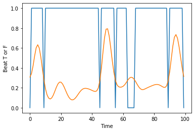
>
>1 Withheld
>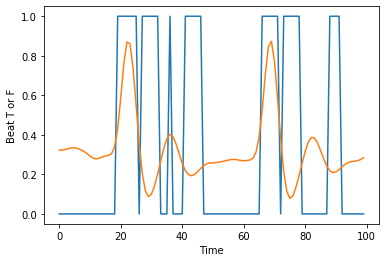
>
>2 Withheld
>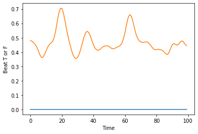
>
>3 Withheld
>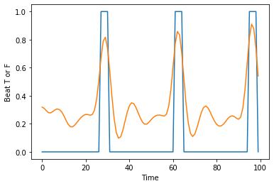
>
>4 Withheld
>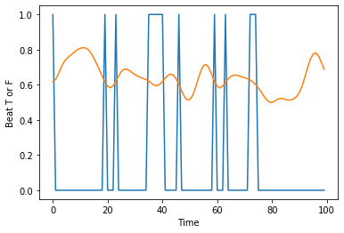
>
>5 Withheld
>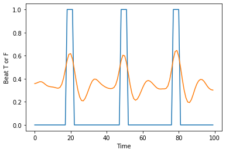
>
>6 Withheld
>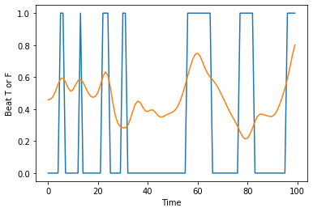
>
>7 Withheld
>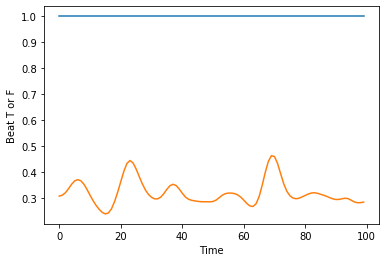
>
>8 Withheld
>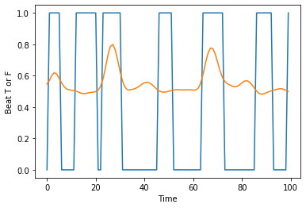
>
>9 Withheld
>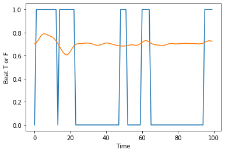
>
>Notice the graphs for 5 Withheld and 3 Withheld they have the prediction plots well fitted while plots like 8 and 3 are unable to be recognized even with the evidenced subtle patterns. I attempted to adjust the filter_cutoff frequency up and down from 0,2 however that does not affect the result form the trained graphs as expected. As a result the training through ML can detect clear and rythmic beats but cannot handle any data that is outside of greater irregularity. However when I zoomed out the training sets makes less sense over all. At times it could not even count the obvious peaks and at times record in detail. An example is 2_Withheld
>2_Hold_2000_to_5000
>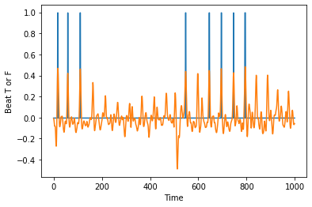

>I noticed that across over several data sets, that the heart beat is not noticed unless the spike is very obvious in the overall scheme of the all of the subjects. Since the height of the peaks depend on the pressure applied at the time the data was applied. It appears as the spikes are dampened, the trained data does not recognize the lesser data sets at all. It doesn't matter which data sets are withheld the results are similar. However if I withold exceptionall bad data like 4_Withheld the zoomed out points are much more sensible. With the recorded beats per minute a lot more accurate otherwise
>4_Hold_2000_to_5000
>

>A definite odd thing is that I found when recording the BPM is that it doesn't do well at high heart rates. For example this one 4_Hold_2000_to_5000 has output of the following
```
NUMBER OF TRAIN_IDS:10
Clip recorded Heart Rate: 60.0
ML recorded Heart Rate: 75.0

Clip recorded Heart Rate: 62.0
ML recorded Heart Rate: 51.66666666666668

Clip recorded Heart Rate: 69.0
ML recorded Heart Rate: 60.0

Clip recorded Heart Rate: 111.0
ML recorded Heart Rate: 90.0

Clip recorded Heart Rate: 62.0
ML recorded Heart Rate: 75.0

Clip recorded Heart Rate: 58.0
ML recorded Heart Rate: 73.33333333333333

Clip recorded Heart Rate: 86.0
ML recorded Heart Rate: 68.33333333333334

Clip recorded Heart Rate: 61.0
ML recorded Heart Rate: 85.0

Clip recorded Heart Rate: 89.0
ML recorded Heart Rate: 81.66666666666667

Clip recorded Heart Rate: 59.0
ML recorded Heart Rate: 76.66666666666667

Peaks Counted: 451
```
The result might be because of the ML unable to cover the more significant heart rates on ones with steady peaks but if there are significant peak difference then the ML would not catch the low ones at all.
The result seriously depends on what data is held and the significant peak difference between force applied. Maybe that is why the reference heart clippers is a clip so it supplies a constant pressure.


