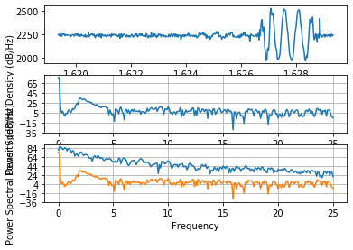

# ECE16 Lab05 Report
Prepared by Mike Liu
03/09/2020

>Q. If your sampling rate was 120Hz, what would be your maximum frequency (the Nyquist frequency)?

>A. If the sampling rate was 120Hz the maxiumum frequency is 60Hz because the Nyquist frequency is half of hte sampling rate.

>Q. If your signal bandwidth is composed of 0-10Hz, what is your minimum sampling rate to capture this signal based on the Nyquist sampling theorem? What would be recommended in general practice however?

>A. If the signal bandwith is composed of 0 - 10Hz the minimum smapling rate is 20Hz to capture this signal based on the Nyquist sampling theorem. Howeer for general practice we use 40Hz (4 times the maximum).

>Q. Show the code - Use np.argmax to find the actual dominant frequency of the x acceleration (currently labeled as 1Hz in the above plot). The aim here is to use argmax to get the index of the maximum value of Pxx and then use that index to get the corresponding frequency in the Freqs array. Try this with and without removing the DC offset. What do you get?

>A. Without the DC offset the np.argmax gets the index with the highest value which is at 0Hz since there is an obvious spike in the graph at 0Hz when it starts recording. That is without the DC offset
```python
import numpy as np
import matplotlib.pyplot as plt
from scipy import signal

data_array = np.genfromtxt('appendix_a.csv', delimiter=',')#get data from Appendix A and save as .csv.

fs = 50#sampling rate in Hz
t = data_array[:,0]#get the time array
s = data_array[:,1]#get the x-acceleration array
z = data_array[:,4]
det = signal.detrend(z)

plt.subplot(311)
plt.plot(t, s)
plt.subplot(312)
plt.psd(s, NFFT=len(t), Fs=fs) #plot the power spectral density
plt.subplot(313)
plt.psd(det, NFFT=len(t), Fs=fs)
Pxx, Freqs = plt.psd(s, NFFT=len(t), Fs=fs)
pmax = np.argmax(Pxx)
print(pmax)
plt.show()
```
>Q. If we don’t remove the DC offset first, how can we index Pxx such that when we calculate argmax, we don’t look at the Pxx[0] (skipping the 0 index).

>A. If we don't remove the DC offset first, we can index Pxx to remove the first element of its array by using Pxx[0:] that makes a new array that does not have the first element of Pxx
```python
skipped_index=0
index_skipped=skipped_index+1
pmax = np.argmax(Pxx[skipped_index:])+index_skipped
print(pmax)
```
>Q. What is the dominant frequency for the y and z acceleration in the sample?

>A. The dominant frequency for all accelerations (x through z) are all at 1Hz
>
>x
>
>y
>
>z

## Challenges

### Challenge 1
Write the code to filter the response from Appendex A through signal.butter() in order to filter a low pass signal from Scipy
>Q. Looking at the documentation for signal.butter, how would you make a high pass filter with a cut off of 0.8Hz? Of the previous time based filters in Lab 4, which filter is most like the high pass filter?

>A.  To make a high pass filter with a cutoff at 0.8Hz use signal.butter(3, 0.0032,'highpass') where 0.0032 is the half-cycles/sample of Nyquist sampling while still using 3rd order. Of the previous time based filters the detrending the moving average looks most like a high pass filter but it has a less of a curve there.

### Challenge 2


